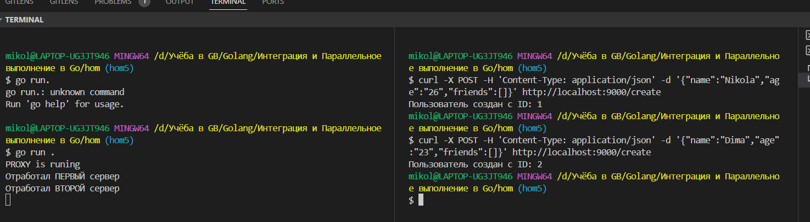
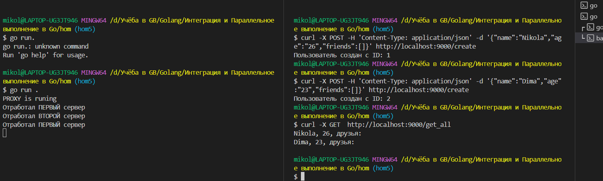
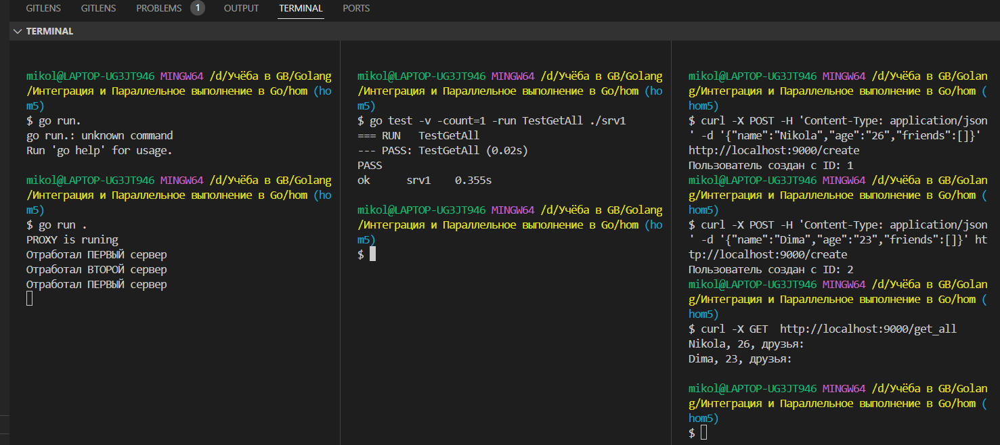

## Тут будут задание к дз и пояснения.

## Задание

Цель практической работы:
Научиться писать микросервис и proxy,
тестировать написанное приложение.
Что нужно сделать:
-В прошлом домашнем задании вы писали приложение, которое принимает HTTP-запросы, создаёт пользователей, добавляет друзей и так далее. Давайте теперь приблизим наше приложение к реальному продукту.
-Отрефакторьте приложение так, чтобы вы могли поднять две реплики данного приложения.
-Используйте любую базу данных, чтобы сохранять информацию о пользователях, или можете сохранять информацию в файл, предварительно сереализуя в JSON.
-Напишите proxy или используйте, например, nginx.
-Протестируйте приложение.

## Скрины

